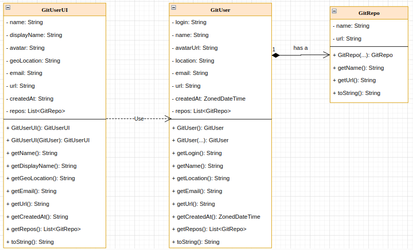

# GitScraper
An app that scrapes user data from GitHub.

## Table of contents
- [GitScraper](#gitscraper)
  - [Table of contents](#table-of-contents)
  - [Overview](#overview)
    - [The challenge](#the-challenge)
    - [UML Diagram](#uml-diagram)
    - [Architecture Diagram](#architecture-diagram)
    - [Screenshot](#screenshot)
  - [My process](#my-process)
    - [Built with](#built-with)
    - [How to use the app](#how-to-scrape-data---native)
    - [What I learned](#what-i-learned)
    - [Useful resources](#useful-resources)
  - [Author](#author)

## Overview

### The challenge
Users should be able to:
- Retrieve API data about a GitHub user by pinging a REST endpoint.
- See the user data displayed as JSON.

## UML Diagram


## Architecture Diagram


## Screenshot


## My process
### Built With
* Spring Boot v2.7.7
  * Spring Web
  * Spring Cache
  * Spring Retry v1.3.2
  * Spring AOP (required dependency for Retry)
* Java 11
* Project Lombok 
* Testing
  * JUnit 5
  * AssertJ v3.24.1
* Springfox API Documentation v3.0.0
* GitHub REST API

### How to Scrape Data - Native
1. Start the app using the `./gradlew bootRun` command
   * If on Windows, run: `gradle bootRun`
2. Ping the REST endpoint with command: `curl -v localhost:8080/scraper/api/v1/git/${username} | json_pp`, or use Postman.
     * Replace `${username}` with a valid Github username `String`
3. The endpoint will return your desired user data as JSON.

### How to Scrape Data - Docker (Optional)
1. Ensure you have Docker installed, and if you dont, go [here](https://docs.docker.com/get-docker/)
2. Pull the image from my Docker Hub: `docker pull belum/spring-git-scraper:latest`
3. Check if the image was downloaded successfully: `docker images`
4. Run the image with: `docker run -it -p8080:8080 belum/spring-git-scraper:latest`
5. Interact with the endpoint using the Native instructions

### What I Learned

I learned how to get Jackson JSON to serialize JDK 8 Date/Time types.

```groovy
    implementation 'com.fasterxml.jackson.datatype:jackson-datatype-jsr310:2.13.4'
    testRuntimeOnly 'com.fasterxml.jackson.datatype:jackson-datatype-jsr310:2.13.4'
```

```java
@Configuration
public class ApplicationConfig {
  @Bean
  public ObjectMapper objectMapper() {
    ObjectMapper mapper = new ObjectMapper();
    mapper.registerModule(new JavaTimeModule());
    return mapper;
  }
}
```

I learned how to cache the data using Spring Cache.
```groovy
implementation 'org.springframework.boot:spring-boot-starter-cache'
```

```java
@Configuration
@EnableCaching
public class ApplicationConfig {
  @Bean
  public CacheManager cacheManager() {
    SimpleCacheManager cacheManager = new SimpleCacheManager();
    cacheManager.setCaches(List.of(
            new ConcurrentMapCache("users"),
            new ConcurrentMapCache("repos")
    ));
    return  cacheManager;
  }
}
```

```java
@Service
public class GithubServiceImpl implements GithubService {

  private HttpEntity<String> httpEntity() {
    HttpHeaders headers = new HttpHeaders();
    headers.set("Cache-Control", "public, max-age=60, s-maxage=60");
    return new HttpEntity<>(headers);
  }
    
  @Override
  @Cacheable(value = "users")
  public GitUser getUserData(String username) {
      //blank for brevity
  }

  @Override
  @Cacheable(value = "repos")
  public List<GitRepo> getRepoData(String username) {
    //blank for brevity
  }
}
```

### Useful resources
- [Baeldung - Spring Cache](https://www.baeldung.com/spring-cache-tutorial) - I learned how to use the Spring Cache module.
- [Baeldung - Spring Retry](https://www.baeldung.com/spring-retry) - I learned how to use the Spring Retry module.
- [GitHub REST API - Quickstart](https://docs.github.com/en/rest/quickstart?apiVersion=2022-11-28) - This helped me learn about the Github REST API.
- [GitHub REST API - Get User](https://docs.github.com/rest/reference/users#get-a-user) - Reference docs to get a user from GitHub.
- [GitHub REST API - Get Repos for User](https://docs.github.com/en/rest/repos/repos?apiVersion=2022-11-28#list-repositories-for-a-user) - Reference docs to get a user's repos from GitHub.

## Author
- GitHub - [@BelumS](https://github.com/BelumS/spring-git-scraper)
